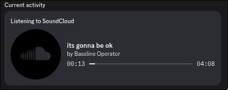

# Discord-Bridge RPC for ToolCloud Browser Addon

This script allows you to display your Soundcloud listening status on your Discord rich presence when used with the ToolCloud addon for Firefox.

#### Preview

# Usage

For this Script to work you first have to create your own Discord Application in the [Discord Developer Portal](https://discord.com/developers/).

The name of that Application determines what the Title of the Rich Presence is, I chose "Listening to Soundcloud" as seen in the [Preview](#preview).

The image of the Application is the image shown in the Rich Presence. This can also be overidden manually by adding custom Art Assets to the Discord application, then setting the attribute `largeImageKey` with the name of the asset in the `const presence` set in index.js (eg. `largeImageKey: "soundcloud-icon"`).

Then follow these Steps:

1. After cloning the repository, find your Discord application id and replace the value of `const clientId` in index.js with your application id.You can find it on the "General information" tab of your Discord application
2. Install nodejs and npm
3. When inside the folder, do `npm install` and then start the script with `node index.js`

This script will then try to connect to your open Discord application and ToolCloud addon for Firefox. 

When connected succesfully it will start displaying your player status on your Discord rich presence

Please note that the Addon connection only works if you have Soundcloud open in any tab.
